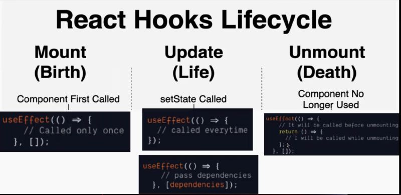
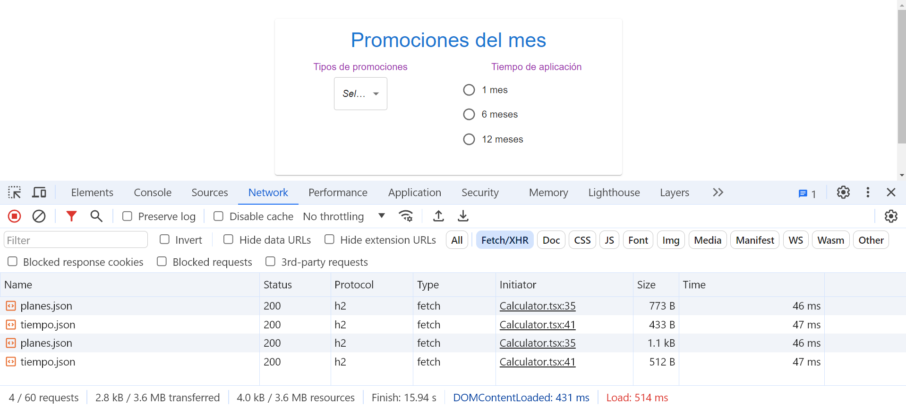

[Regresar](/DAWM/)

React - Hooks: useEffect
===============


El hook useEffect es una herramienta fundamental en React para manejar efectos secundarios en componentes funcionales. Los efectos secundarios son operaciones que pueden tener impactos fuera del ámbito directo de la función en la que se ejecutan, como la manipulación del DOM, la suscripción a servicios externos, la realización de peticiones HTTP, y la configuración de timers.

<div align="center">
	
	<p>Fuente: <a href="https://www.linkedin.com/posts/moumita-das07_reactjs-frontenddevelopment-react-activity-7083057860988837888-xEHK/">React Hooks lifecycle method</a> </p>
</div>

El hook useEffect combina el comportamiento de los métodos del ciclo de vida **componentDidMount** y **componentDidUpdate** en componentes funcionales.

* Si el segundo argumento (la lista de dependencias) es un array vacío [], el efecto se ejecutará solo una vez después del primer renderizado (similar a **componentDidMount**).
* Si no se proporciona un segundo argumento, el efecto se ejecutará después de cada renderizado (similar a **componentDidUpdate**).

De variable locales ... 
==========

* * *

* En el componente `Calculator.tsx`, comente las variables locales **menuItems** y **radioItems**

```tsx
...
	{/* Datos */ }

	/*
		let menuItems = [ ... ]
	*/

	/*
		let radioItems = [ ... ]
	*/
...
```

... a variables de estado
==========

* * *

* En el componente `Calculator.tsx`, importe la interfaz **Datum**

```typescript
import Datum from '../interfaces/Datum.tsx';

export default function Calculator({ setPlan, setResult }) {
    ...
}
```

* En el componente `Calculator.tsx`, agregue la desestructuración de arreglo (**estado actual** y **función de actualización**) para declarar los estados del componente. El valor predeterminado de ambos estado actual es [].

```tsx
export default function Calculator({ setPlan, setResult }) {

  {/* Hooks: useState */ }
  ...
  const [menuItems, setMenuItems] = React.useState<Array<Datum>>([]);
  const [radioItems, setRadioItems] = React.useState<Array<Datum>>([]);

  ...

}
```

* En el componente `Calculator.tsx`, agregue el hook **useState** con las peticiones asincrónicas. En cuanto los datos sean recibidos y convertidos a JSON, se utilizarán las funciones de actualización de los estados. 

```tsx
export default function Calculator({ setPlan, setResult }) {

	{/* Hooks: useState */ }

	...

	{/* Hooks: useEffect */ }
	React.useEffect(() => {

	    (async () => {

				const res = await fetch('https://raw.githubusercontent.com/aavendan/datos/main/tutoriales/planes.xml');
				const textXML = await res.text();

				const parser = new DOMParser();
				const xml = parser.parseFromString(textXML, "application/xml");

				const data = Array.from(xml.getElementsByTagName("item")).map(element => {
					return {
						"title": element.getElementsByTagName("title")[0].innerHTML,
						"subtitle": element.getElementsByTagName("subtitle")[0].innerHTML,
						"intro": element.getElementsByTagName("intro")[0].innerHTML,
						"description": element.getElementsByTagName("description")[0].innerHTML,
					}
				})

				setMenuItems(data)

	      {/*const res = await fetch('https://raw.githubusercontent.com/aavendan/datos/main/tutoriales/planes.json');
	      const data = await res.json();
	      setMenuItems(data)*/}
	    
	    })();

	    (async () => {
	    
	      const res = await fetch('https://raw.githubusercontent.com/aavendan/datos/main/tutoriales/tiempo.json');
	      const data = await res.json();
	      setRadioItems(data)
	    
	    })();

	}, [])

	...
}
```

* Compruebe los requerimientos asíncronos con el inspector.



Resultado Final
==========

* * *

* Selecciona la opción **Suscripción** a **6 meses**
* Compruebe el funcionamiento del servidor, con: **npm run dev**
* Acceda al URL [http://localhost:5174/](http://localhost:5174/)


Referencias
=======

* Quick Start. (n.d.). Retrieved from https://react.dev/learn
* Vite. (n.d.). Retrieved from https://vitejs.dev/
* Cómo iniciar un proyecto React con Vite. (2022). Retrieved from https://carlosazaustre.es/react-vite
* Consumiendo APIs con ReactJS: Aprende useEffect y useState (2024). Retrieved from https://www.freecodecamp.org/espanol/news/consumiendo-una-api-rest-con-react-js/
* How to fetch XML in JavaScript (no date) Code to go. Available at: https://codetogo.io/how-to-fetch-xml-in-javascript/ (Accessed: 22 June 2024). 