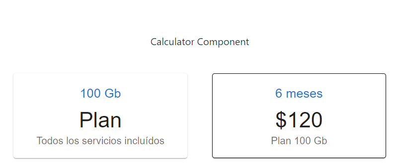

[Regresar](/DAWM/)

React - Hooks: useEffect
===============

El hook useEffect es una herramienta fundamental en React para manejar efectos secundarios en componentes funcionales. Los efectos secundarios son operaciones que pueden tener impactos fuera del ámbito directo de la función en la que se ejecutan, como la manipulación del DOM, la suscripción a servicios externos, la realización de peticiones HTTP, y la configuración de timers.

	
	
Fuente: <a href="https://www.linkedin.com/posts/moumita-das07_reactjs-frontenddevelopment-react-activity-7083057860988837888-xEHK/">React Hooks lifecycle method</a> 

El hook useEffect combina el comportamiento de los métodos del ciclo de vida **componentDidMount** y **componentDidUpdate** en componentes funcionales.

* Si el segundo argumento (la lista de dependencias) es un array vacío [], el efecto se ejecutará solo una vez después del primer renderizado (similar a **componentDidMount**).
* Si no se proporciona un segundo argumento, el efecto se ejecutará después de cada renderizado (similar a **componentDidUpdate**).

Hooks: useEffect
==========

* * *

* Compruebe el funcionamiento del servidor, con: **npm run dev**
* Acceda al URL [http://localhost:5174/](http://localhost:5174/)

Referencias
=======

* Quick Start. (n.d.). Retrieved from https://react.dev/learn
* Vite. (n.d.). Retrieved from https://vitejs.dev/
* Cómo iniciar un proyecto React con Vite. (2022). Retrieved from https://carlosazaustre.es/react-vite
* Consumiendo APIs con ReactJS: Aprende useEffect y useState (2024). Retrieved from https://www.freecodecamp.org/espanol/news/consumiendo-una-api-rest-con-react-js/