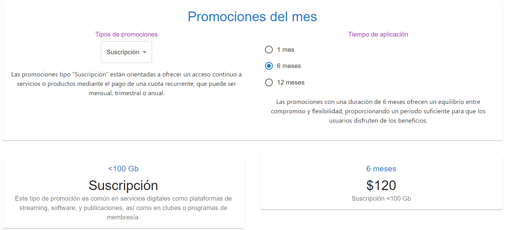

[Regresar](/DAWM/)

React - Hooks: useState
===============


El Hook de useState ofrece una variable de estado para mantener los datos entre renderizados y una función que coloca el estado para actualizar la variable y provocar que React renderice el componente nuevamente.

<div align="center">
	
	<p>Fuente: <a href="http://www.room51.co.uk/tutorials/react/usestate/part1.html">Managing component state with the useState Hook</a> </p>
</div>

Hooks: useState
==========

* * *

* En el componente `Calculator.tsx`, agregue la referencia a los componentes:

```tsx
import * as React from 'react';

...
```

* En el componente `Calculator.tsx`, agregue la desestructuración de arreglo (**estado actual** y **función de actualización**) para declarar los estados del componente. El valor predeterminado de ambos estado actual es -1.

```tsx
...

export default function Calculator() {

  {/* Hooks: useState */}
  const [planId, setPlanId] = React.useState(-1);
  const [timeId, setTimeId] = React.useState(-1);

  ...

}
```

* En el componente `Calculator.tsx`, actualice los manejadores de eventos al invocar la **función de actualización** de la variable de **estado actual**.

```tsx
...
	{/* Manejadores de eventos */}
	  
	const handleChangeSelect = (event: SelectChangeEvent) => {
		setPlanId(parseInt(event.target.value))
	};

	const handleChangeRadio = (event: React.ChangeEvent<HTMLInputElement>) => {
		setTimeId(parseInt((event.target as HTMLInputElement).value))
	};

      {/* JSX */ }

  	return ( ... )
...
```


* En el componente `Calculator.tsx`, use la variable estado para acceder a la descripción del elemento actual. 

```tsx
...
	{/* Select */}

	...
	</Select>

	<p>
      	{(planId != -1)?menuItems[planId].intro:''}
     </p>
...
```

y 


```tsx
...
	{/* Radio Group */}

	...
    </RadioGroup>

    <p>
      {(timeId != -1)?radioItems[timeId].intro:''}
    </p>
...
```

* Compruebe el funcionamiento del servidor, con: **npm run dev**
* Acceda al URL [http://localhost:5174/](http://localhost:5174/)



Referencias
=======

* Quick Start. (n.d.). Retrieved from https://react.dev/learn
* Vite. (n.d.). Retrieved from https://vitejs.dev/
* Cómo iniciar un proyecto React con Vite. (2022). Retrieved from https://carlosazaustre.es/react-vite
