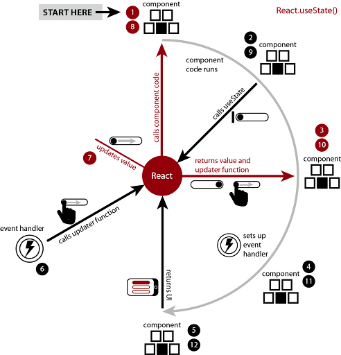
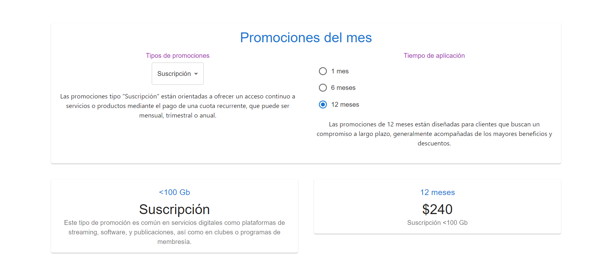

[Regresar](/DAWM/)

React - Hooks: useState II
===============


El Hook de useState ofrece una variable de estado para mantener los datos entre renderizados y una función que coloca el estado para actualizar la variable y provocar que React renderice el componente nuevamente.

<div align="center">
	
	<p>Fuente: <a href="http://www.room51.co.uk/tutorials/react/usestate/part1.html">Managing component state with the useState Hook</a> </p>
</div>

App.tsx: Hook - useState
==========

* * *

* En el componente `App.tsx`, agregue la referencia a los componentes:

```tsx
import * as React from 'react';

...
```

* En el componente `App.tsx`, agregue la desestructuración de arreglo (**estado actual** y **función de actualización**) para declarar los estados del componente. El valor predeterminado de ambos estado actual es -1.

```tsx
...

function App() {

  {/* Hooks: useState */}
  const [plan, setPlan] = React.useState(new Array<String>());
  const [result, setResult] = React.useState(new Array<String>());

  ...

}
```

App.tsx: Callbacks
==========

* * *

* En el componente `App.tsx`, agregue los callbacks que serán enviados al componente **Calculator**.

```tsx
...

function App() {

  {/* Hooks: useState */}
  ...

  {/* Callbacks */}
  const getPlan = (msgPlan: Array<String>) => {
    setPlan(msgPlan);
  };

  const getResult = (msgResult: Array<String>) => {
    setResult(msgResult);
  };

...

}
```

* En el componente `App.tsx`, envíe los callbacks al componente **Calculator**.

```tsx
...
function App() {

	...
		<Grid xs={12} sm={12} md={12} lg={12} >
			<Calculator setPlan={getPlan} setResult={getResult}/>
		</Grid>
	...
}
```

Calculator.tsx: Callbacks como Props
==========

* * *

* En el componente `Calculator.tsx`, agregue los callbacks como props.

```tsx
...
export default function Calculator( {setPlan, setResult} ) {
...
}
```

* En el componente `Calculator.tsx`, modifique los manejadores de eventos.

```tsx
...
export default function Calculator( {setPlan, setResult} ) {

  ...

  {/* Manejadores de eventos */}

  const handleChangeSelect = (event: SelectChangeEvent) => {
    let newMenuId = parseInt(event.target.value)
    setPlanId(newMenuId)
    
    let newMenuItem = (newMenuId != -1)?menuItems[newMenuId]:null;
    setPlan([
      newMenuItem?.title, 
      newMenuItem?.subtitle, 
      newMenuItem?.description 
    ]);

  };

  const handleChangeRadio = (event: React.ChangeEvent<HTMLInputElement>) => {
    let newChangeId = parseInt((event.target as HTMLInputElement).value)
    setTimeId(newChangeId)
    
    let newChageItem = (newChangeId != -1)?radioItems[newChangeId]:null;
    let month = (newChageItem?.title as String).substring(0,2)
    let subtotal = (parseInt(month)* 20).toString()
    let total = "$"+subtotal
    setResult( [ newChageItem?.title, newChageItem?.description, total ])

  };

}
```


App.tsx: Variable de estado como Props
==========

* * *

* En el componente `App.tsx`, modifique el valor de los props en los componentes **Plan** y **Result**:

```tsx
...
  return (
    
    ...

    <Grid xs={12} sm={6} md={6} lg={6}>
      <Plan title={plan[0]} subtitle={plan[1]} description={plan[2]} />
    </Grid>
    <Grid xs={12} sm={6} md={6} lg={6}>
      <Result title={result[2]} subtitle={result[0]} description={plan[0] + " " + plan[1]}/>
    </Grid>
    ...
  )
...
```

App.tsx: Renderización condicionada
==========

* * *

* En el componente `App.tsx`, condicione la renderización con las variables de estado.

```tsx
...
  return (
    
    ...

    <Grid xs={12} sm={6} md={6} lg={6}>
        {
          plan.length>0?
            <Plan title={plan[0]} subtitle={plan[1]} description={plan[2]} />
            :
            <></>
        }
      </Grid>
      <Grid xs={12} sm={6} md={6} lg={6}>
        {
          plan.length>0 && result.length>0?
            <Result title={result[2]} subtitle={result[0]} description={plan[0] + " " + plan[1]}/>
            :
            <></>
        }
      </Grid>
    ...
  )
...
```


* Compruebe el funcionamiento del servidor, con: **npm run dev**
* Acceda al URL [http://localhost:5174/](http://localhost:5174/)



Referencias
=======

* Quick Start. (n.d.). Retrieved from https://react.dev/learn
* Vite. (n.d.). Retrieved from https://vitejs.dev/
* Cómo iniciar un proyecto React con Vite. (2022). Retrieved from https://carlosazaustre.es/react-vite
