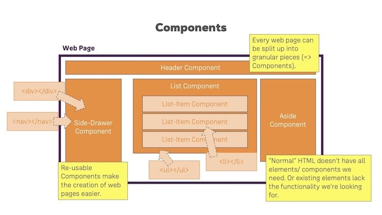
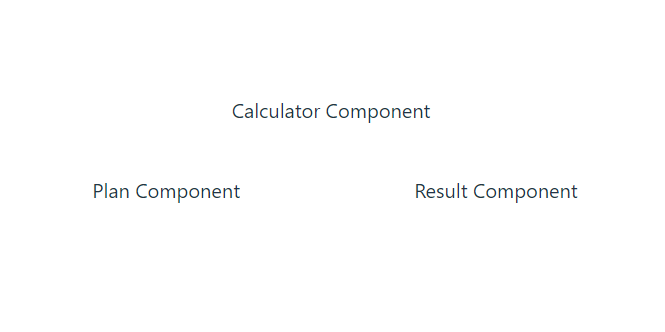

[Regresar](/DAWM/)

React - MUI + Componentes Propios
===============


Componentes Propios
==========

* * *

JSX es una extensión de sintaxis para JavaScript que le permite escribir etiquetas similares a HTML dentro de un archivo JavaScript. Aunque existen otras formas de escribir componentes, la mayoría de los desarrolladores de React prefieren la concisión de JSX y la mayoría de las bases de código lo utilizan.

<div align="center">
    
    <p>Fuente: <a href="https://dev.to/rwparrish/react-basics-2je1">React Basics</a> </p>
</div>

Componente Plan
==========

* * *

* Cree el archivo `src/components/Plan.tsx`, con el contenido:

```jsx
export default function Plan() {
    return (
        <>
            Plan Component
        </>
    )
}
```


Componente Calculator
==========

* * *

* Cree el archivo `src/components/Calculator.tsx`, con el contenido:

```jsx
export default function Calculator() {
    return (
        <>
            Calculator Component
        </>
    )
}
```

Componente Result
==========

* * *

* Cree el archivo `src/components/Result.tsx`, con el contenido:


```jsx
export default function Result() {
    return (
        <>
            Result Component
        </>
    )
}
```

MUI
==========

* * *

* Desde la línea de comandos, [instale React MUI](https://mui.com/material-ui/getting-started/installation/) con:

```prompt
npm install @mui/material @emotion/react @emotion/styled
```

Componente App: Grid v2
==========

* * *

* En el componente `App.tsx`, agregue la referencia al componente [Grid 2](https://mui.com/material-ui/react-grid2/).

```typescript
import Grid from '@mui/material/Unstable_Grid2'; // Grid version 2
...
import './App.css'
```

* En el componente `App.tsx`, agregue la referencia los componentes **Calculator**, **Plan** y **Result**.

```typescript
...
import './App.css'

import Calculator from './components/Calculator';
import Plan from './components/Plan';
import Result from './components/Result';
```

* En `App.tsx`, reemplace el contenido a renderizar por:

```jsx
...

function App() {
	...

	return (
		<Grid container spacing={5}>
			<Grid xs={12} sm={12} md={12} lg={12}>
				<Calculator/>
			</Grid>
			<Grid xs={12} sm={6} md={6} lg={6}>
				<Plan />
			</Grid>
			<Grid xs={12} sm={6} md={6} lg={6}>
				<Result/>
			</Grid>
		</Grid>
    )
}

export default App
```

* Compruebe el funcionamiento del servidor, con: **npm run dev**
* Acceda al URL [http://localhost:5174/](http://localhost:5174/)




Referencias
=======

* Quick Start. (n.d.). Retrieved from https://react.dev/learn
* Vite. (n.d.). Retrieved from https://vitejs.dev/
* Cómo iniciar un proyecto React con Vite. (2022). Retrieved from https://carlosazaustre.es/react-vite
