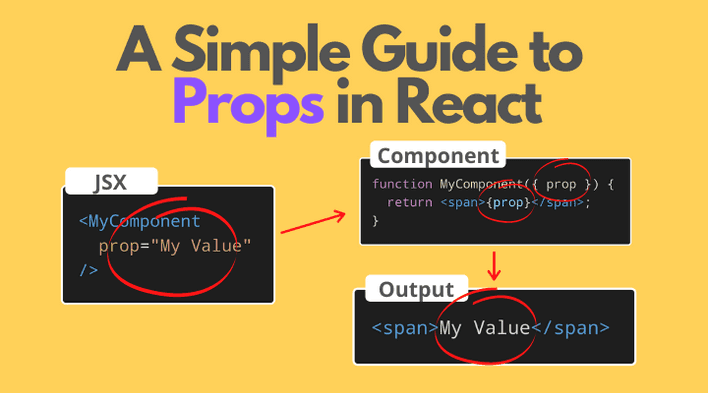

[Regresar](/DAWM/)

React - Interfaces + Props
===============


Props
==========

* * *

Los componentes de React emplean props como medio de comunicación entre ellos. Mediante el uso de props, un componente padre puede transmitir información a sus componentes hijos. Aunque las props pueden tener cierta similitud con los atributos HTML, su función va más allá, ya que posibilitan la transmisión de diversos valores de JavaScript, como objetos, arrays y funciones.

<div align="center">
    
    <p>Fuente: <a href="https://dev.to/rwparrish/react-basics-2je1">React Basics</a> </p>
</div>

Interfaz
==========

* * *

* Cree el archivo `src/interface/Datum.tsx`, con el contenido:

```jsx
export default interface Datum {
    title: String;
    subtitle: String;
    description?: String;
    intro?: String;
}
```

Componente MUI: Card
==========

* * *

* En los componentes `Plan.tsx` y `Result.tsx`, agregue la referencia al componente [Card](https://mui.com/material-ui/react-card/) y sus componentes asociados.

```typescript
...
import Typography from '@mui/material/Typography';
import Card from '@mui/material/Card';
import CardContent from '@mui/material/CardContent';
import { CardActionArea } from '@mui/material';
...
```

* En los componentes `Plan.tsx` y `Result.tsx`, reemplace el contenido a renderizar por:

```typescript
...
export default function <COMPONENTE>() {
    return (
        <Card>
        <CardActionArea>
            <CardContent>
                <Typography gutterBottom component="h2" variant="h6" color="primary">
                    Subtítulo
                </Typography>
                <Typography component="p" variant="h4">
                    Título
                </Typography>
                <Typography color="text.secondary" sx={{ flex: 1 }}>
                    Descripción
                </Typography>
            </CardContent>
        </CardActionArea>
    </Card>
    )
}
```

* En los componentes `Plan.tsx` y `Result.tsx`, importe la interfaz **Datum** y agregue el parámetro **data: Datum**

```typescript
import Datum from '../interfaces/Datum.tsx';

export default function <COMPONENTE>(data: Datum) {
    ...
}
```

* Renderice el objeto **data** en el JSX:

```typescript
...
export default function <COMPONENTE>(data: Datum) {
    return (
        <Card>
            <CardActionArea>
                <CardContent>
                    <Typography gutterBottom component="h2" variant="h6" color="primary">
                        {data.subtitle}
                    </Typography>
                    <Typography component="p" variant="h4">
                        {data.title}
                    </Typography>
                    <Typography color="text.secondary" sx={{ flex: 1 }}>
                        {data.description}
                    </Typography>
                </CardContent>
            </CardActionArea>
        </Card>
    )
}
```

Comunicación entre Componentes: Props
==========

* * *

* En el componente `App.tsx`, agregue el contenido a renderizar por:

```typescript
...
function App() {

  return (
    <Grid container spacing={5}>
            <Grid xs={12} sm={12} md={12} lg={12} >
                <Calculator/>
            </Grid>
            <Grid xs={12} sm={6} md={6} lg={6}>
                <Plan title="Plan" subtitle="100 Gb" description="Todos los servicios incluídos" />
            </Grid>
            <Grid xs={12} sm={6} md={6} lg={6}>
                <Result title="$120" subtitle="6 meses" description="Plan 100 Gb"/>
            </Grid>
        </Grid>
  )
}

export default App
```


* Compruebe el funcionamiento del servidor, con: **npm run dev**
* Acceda al URL [http://localhost:5174/](http://localhost:5174/)


Referencias
=======

* Quick Start. (n.d.). Retrieved from https://react.dev/learn
* Vite. (n.d.). Retrieved from https://vitejs.dev/
* Cómo iniciar un proyecto React con Vite. (2022). Retrieved from https://carlosazaustre.es/react-vite
